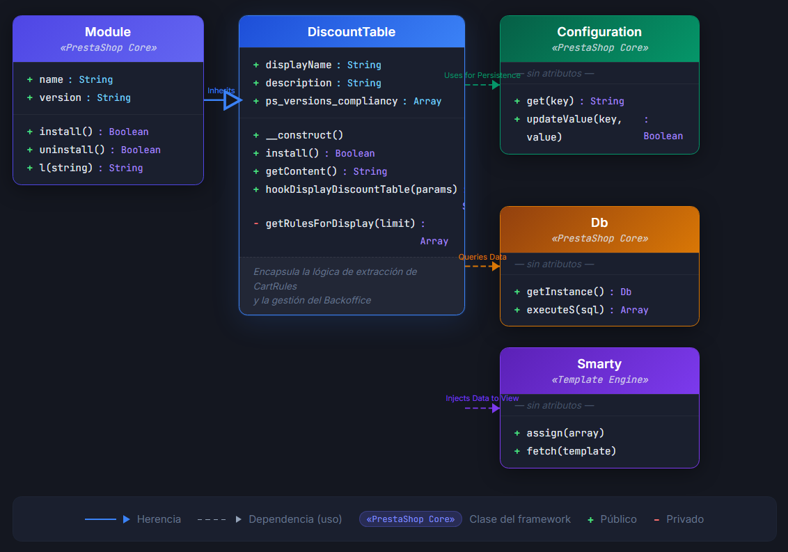

 # Discount Table Pro Module (PrestaShop 8.x / 9.x)

## 📌 Descripción General
Discount Table Pro es un módulo de grado empresarial desarrollado para optimizar la gestión y visualización de promociones por volumen en la plataforma PrestaShop. El sistema automatiza la extracción de lógica de negocio desde el motor nativo de reglas de carrito (`CartRules`) y la inyecta de forma eficiente y desacoplada en la interfaz del producto.

## 🏗️ Arquitectura de Software
El módulo ha sido diseñado bajo estándares de alta disponibilidad y bajo acoplamiento, estructurado en las siguientes capas:

### 1. Capa de Lógica y Persistencia (Backend)
* **Consultas SQL Optimizadas**: Implementación de lógica de acceso a datos mediante `Db::getInstance()` con JOINS relacionales para la recuperación de datos multi-idioma (`ps_cart_rule_lang`).
* **Motor de Filtrado Dinámico**: Sistema de validación en tiempo real que procesa fechas de vigencia (`date_to`), estados de activación y segmentación por ID de categoría.
* **Abstracción de Datos (DTO)**: Capa de transformación que convierte datos brutos del esquema SQL en modelos de datos formateados para la vista (manejo de divisas e internacionalización de porcentajes).

[Image of Model-View-Controller architecture diagram]

### 2. Integración con el Core (Hook System)
* **Inyección Desacoplada**: Uso del hook `displayDiscountTable` para garantizar que la lógica de negocio no interfiera con el rendimiento del Core de PrestaShop.
* **Control de Contexto**: Validación estricta del objeto `Context` y el controlador activo (`php_self`) para asegurar la integridad de la ejecución.

## 🛠️ Stack Tecnológico
* **Lenguaje**: PHP 7.4+ / 8.x / 9.x (Programación Orientada a Objetos).
* **Base de Datos**: MySQL (Optimización de consultas relacionales).
* **Motor de Plantillas**: Smarty Engine (Separación de responsabilidades).
* **Framework**: PrestaShop API (Configuration, Tools, Context, Link).

## 🚀 Funcionalidades de Administración (Backoffice)
El módulo provee una interfaz de administración robusta que incluye:
* **Gestión de Configuración**: Panel CRUD para la persistencia de parámetros operativos (límites de visualización, filtros de categoría y personalización visual).
* **Sincronización de Flujo de Trabajo**: Generación dinámica de enlaces hacia el controlador nativo `AdminCartRules` para facilitar la gestión administrativa directa.
* **Dashboard de Reglas Activas**: Vista resumida en el panel de configuración que muestra el estado actual de las reglas aplicables.

## 📋 Estándares de Calidad
* **Seguridad**: Sanitización de inputs y prevención de ataques XSS mediante el escape selectivo de datos en la capa de presentación.
* **Internacionalización (i18n)**: Implementación de traducciones nativas y formateo de precios basado en el locale del sistema.
* **Rendimiento**: Minimización del uso de memoria mediante la carga selectiva de recursos y validaciones tempranas de ejecución.

---
**Nota de implementación**: Este módulo representa una solución técnica robusta validada para entornos de producción de e-commerce con alta concurrencia.

